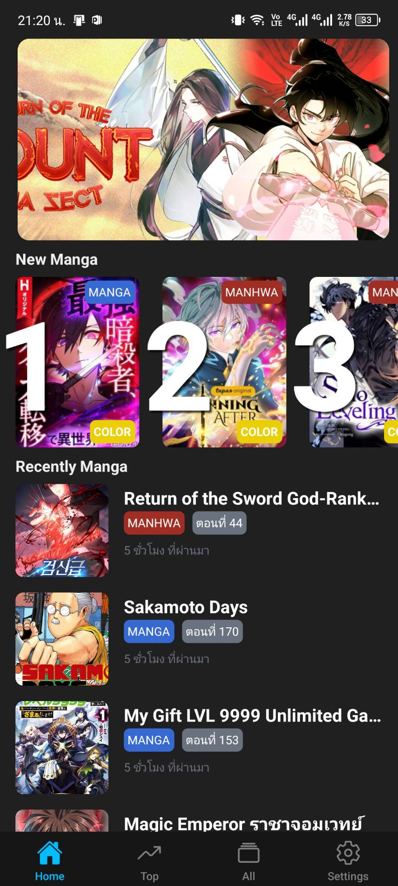
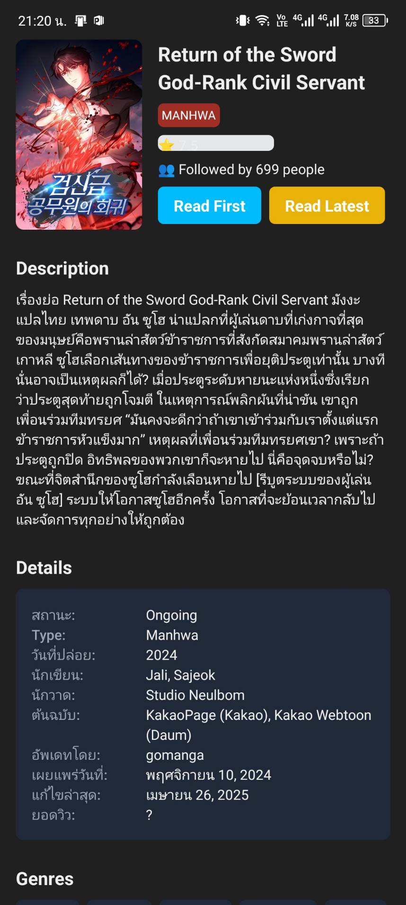
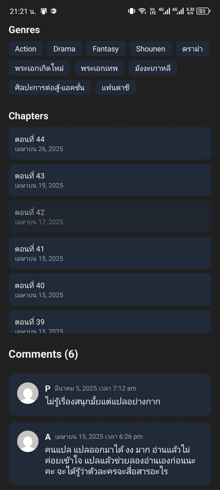

# Manga App

A modern React Native application built with Expo for manga enthusiasts. This app provides a seamless reading experience with a beautiful UI and smooth navigation.

## 📸 Preview

<div align="center">
  
  
  
  
</div>

## 🚀 Features

- Modern UI with Tailwind CSS styling
- Smooth navigation using React Navigation
- State management with Zustand
- Type-safe development with TypeScript
- Responsive design with SafeAreaProvider
- Gradient effects with Expo Linear Gradient
- Async storage for data persistence

## 🛠️ Tech Stack

- **Framework**: React Native with Expo
- **Language**: TypeScript
- **Styling**: Tailwind CSS with NativeWind
- **Navigation**: React Navigation
- **State Management**: Zustand
- **HTTP Client**: Axios
- **Storage**: AsyncStorage
- **Animation**: React Native Reanimated
- **Linting**: ESLint
- **Formatting**: Prettier

## 📦 Installation

1. Clone the repository:
```bash
git clone [your-repository-url]
cd manga-app
```

2. Install dependencies:
```bash
npm install
```

3. Start the development server:
```bash
npm start
```

## 🏃‍♂️ Running the App

- **iOS**: `npm run ios`
- **Android**: `npm run android`
- **Web**: `npm run web`

## 📁 Project Structure

```
manga-app/
├── assets/          # Static assets
├── components/      # Reusable UI components
├── db/             # Database related files
├── hooks/          # Custom React hooks
├── lib/            # Utility functions and libraries
├── screen/         # Screen components
├── store/          # State management
├── types/          # TypeScript type definitions
├── App.tsx         # Root component
└── global.css      # Global styles
```

## 🔧 Development

- Run linter: `npm run lint`
- Format code: `npm run format`

## 📝 License

[Add your license information here]

## 🤝 Contributing

[Add contribution guidelines here]
